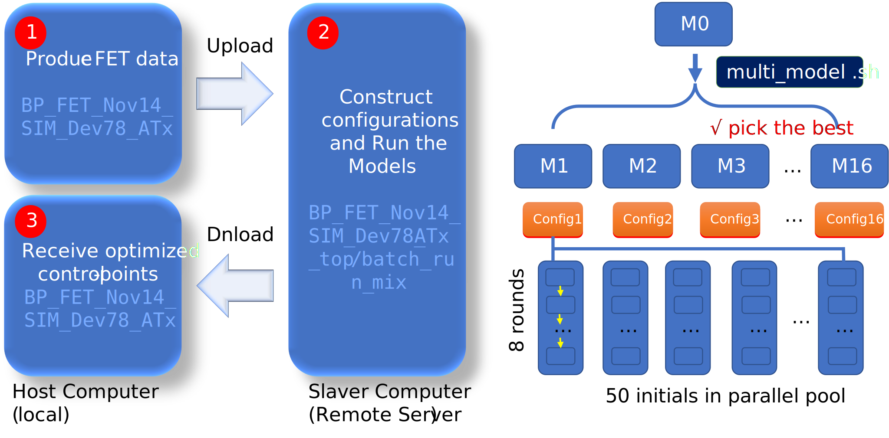
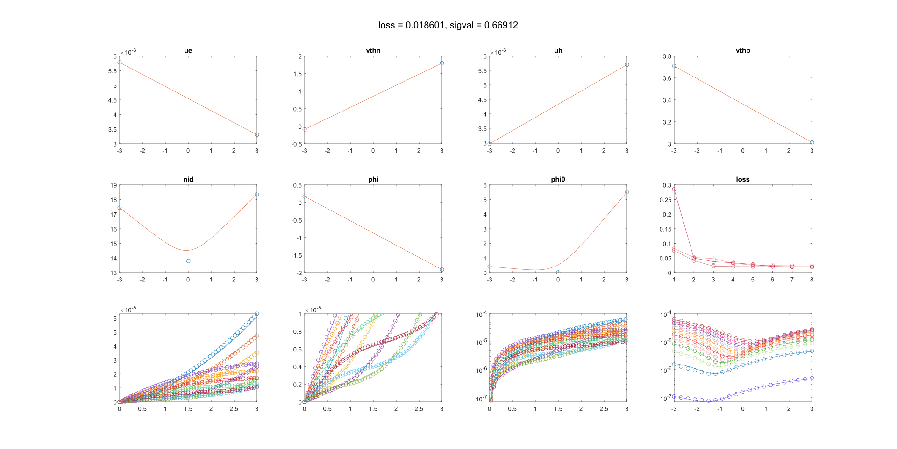
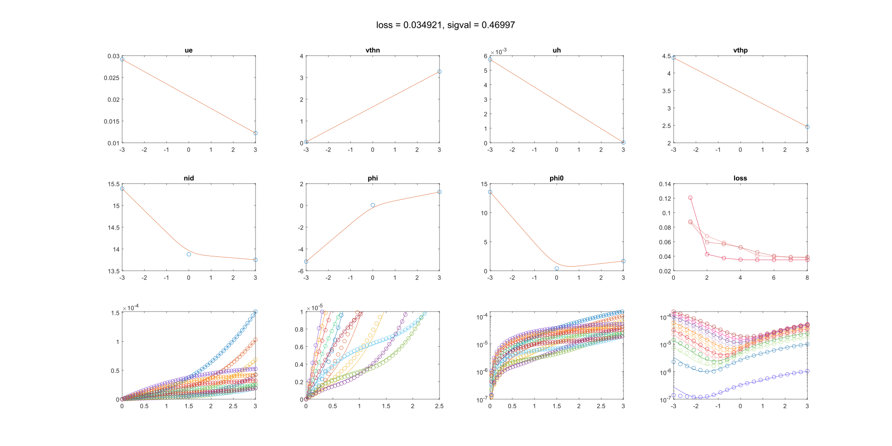
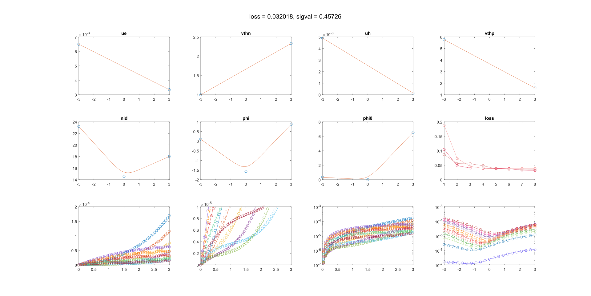
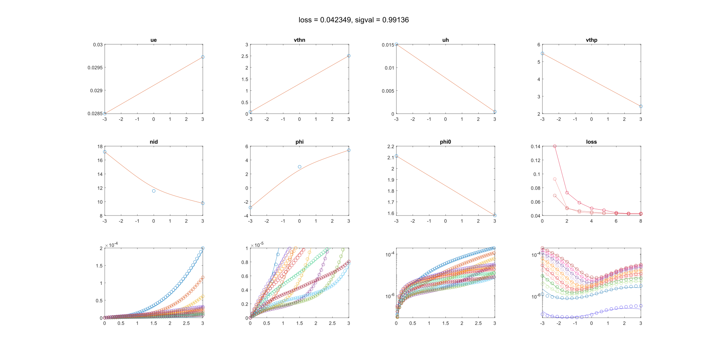
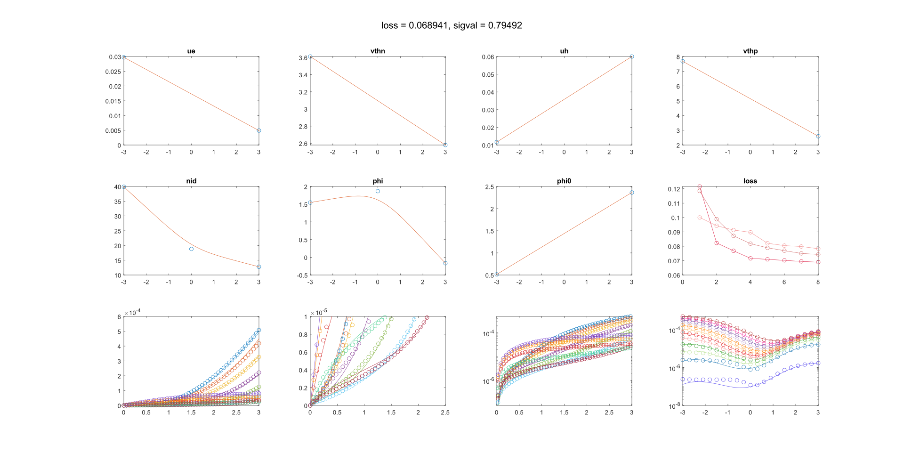
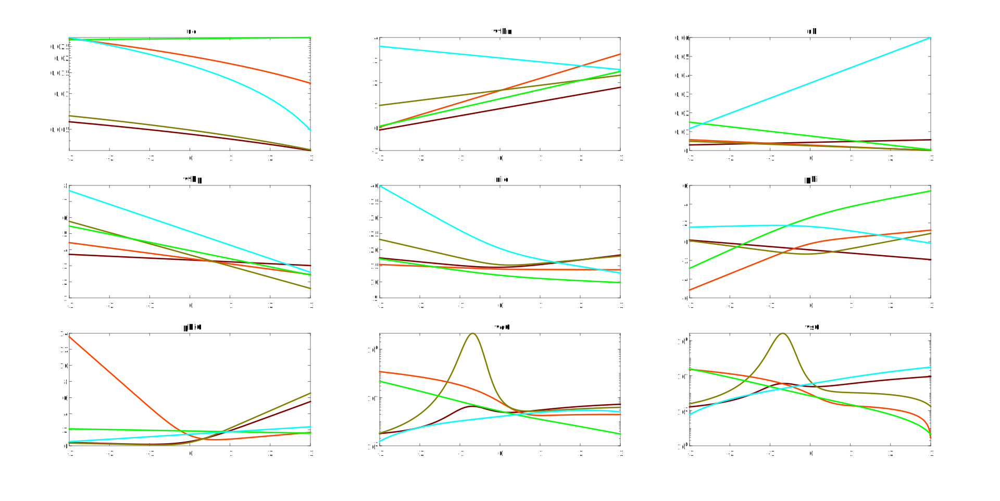
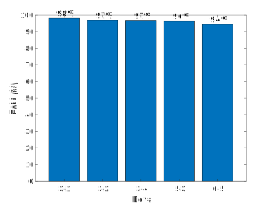

# Gaussian Control Point for Functional Regression Technique

Gaussian-wavelet kernel (GWK) is useful in filtering of noisy data. Here, it is used to construct discrete model space for the correction parameters $\{Y\}$ introduced in the pristine QFLPS model as their function relations with the gate-source bias $V_{gs}$.

Given with $N$ ( $\geq2$ ) ***control points*** $P_i=(v_i,y_i)$, 

$$P_0,P_1,..., P_{N-1}$$

and their linear splines for the $i$-th adjoint pairs $\{P_i,P_{i+1}\}$ as

$$z_{i}(v)=y_i+\alpha_i(v-v_i)$$

where $\alpha_i=(y_{i+1}-y_i)/(v_{i+1}-v_i)$, a $N$-point generated ***control function*** can be defined via its convolution with Gaussian wavelet as

$$P_{N,\sigma}(v)=\int_{v_0}^{v_{N-1}}\frac{1}{\sqrt{2\pi}\sigma}e^{-\frac{(v-\nu)^2}{2\sigma^2}} z(\nu)\,d\nu$$

where $z(\nu)=z_i(\nu)$ for $v_i\leq\nu\leq v_{i+1}$, and $\sigma$ decides the spread width. To suppress the boundary effect, reflection padding is applied in the formula evaluation. Basically, the control function is rendered to pass by the control points, and exactly pass through the points when $\sigma\rightarrow 0$.

Evaluating the integral, one obtains the analytical control function generated by the control points as

$$P_{N,\sigma}(v)=\sum_{i=0}^{N-2} \frac{1}{2}z_i(v) [\text{erf}(u_{i+1}) - \text{erf}(u_{i})] + \frac{\alpha_i\sigma}{\sqrt{2\pi}}(e^{-u_{i}^2}-e^{-u_{i+1}^2})$$

where $u_i=(v_i-v)/\sqrt{2}\sigma$.

***Via the control-function formula above, the functional regression problem is reduced to the parameter regression problem for the control points.***

Here, the voltage-control coordinates $v_i$ is simply assumed as the $(N-1)$-section points of the considered interval.

However, it remains to be decided how many control points (i.e., the $N$ number) are necessary. Overflow control points destroy the convergence of the optimization algorithm. Underflow control points limits the representation ability of the formula. In a word, it requires compromise. In order to define a searchable discrete model set, some limitations should be prescribed.

For basic parameters in the model, including $\mu_n$, $V_{th,n}$, $\mu_p$, and $V_{th,p}$, $N=2$ is fixed, since they are not expected to have peculiar function relations with the gate bias.

For introduced non-ideal temperature factor ``nid`` ( $\eta$ ), and the junction parameters: barrier coupling coefficient ``phi`` ( $\varphi_{ds}$ ) as well as barrier height ``phi0`` ( $\varphi_{ds,0}$ ), their $N$ numbers $N_{nid}$, $N_{phi}$, and $N_{phi0}$ are limited within $2$ or $3$. 

The arrangement of these $N$ number is referred to as the ***configuration*** of the model in this work. 

In the code, ``args_config_func`` function gives the configuration, where besides the three $N$ numbers the upper search bound of the spread coefficient $\sigma$ is specified as the forth component of the output vector (the lower bound is assumed as $0.1$ by default in the code), such as

```matlab
function y=args_config_func(npidx)
conf_data_vec=[
3.000000e+00% N_{nid}
2.000000e+00% N_{phi}
3.000000e+00% N_{phi0}
1.000000e+00
];
y=conf_data_vec(npidx)';
end
```

Eight configurations are considered (16 if consider the upper bound of $\sigma$ ), as defined in the ``write_config_data`` script:

```matlab
args_pts_set=[3 3 3;%1
    3 3 2;%2
    3 2 3;%3
    3 2 2;%4
    2 3 3;%5
    2 3 2;%6
    2 2 3;%7
    2 2 2];%8

config_set=[args_pts_set,args_pts_set(:,1).^0;
    args_pts_set,0.1.*args_pts_set(:,1).^0;];% extended with sigma

% distribute the config to fold
fold_num=size(config_set,1);

func_name='args_config_func';
func_fold='export_conf_func';
func_sub_fold_head='conf_data';

if exist(func_fold,'dir')
    rmdir(func_fold,"s")
end

mkdir(func_fold)

for i=1:fold_num
    func_path=sprintf('.%s%s%s%s%d%s',filesep,func_fold,filesep,func_sub_fold_head,i,filesep);
    mkdir(func_path)
    fileID=fopen([func_path,func_name,'.m'],'w');
    fprintf(fileID,'function y=%s(npidx)\n',func_name);

    fprintf(fileID,'conf_data_vec=[\n');
    fprintf(fileID,'%.6e\n',config_set(i,:)');
    fprintf(fileID,'];\n');

    fprintf(fileID,'y=conf_data_vec(npidx)'';\n');
    fprintf(fileID,'end');
    fclose(fileID);
end
```

The generated functions in the folder ``export_conf_func`` would be distributed by the shell script ``multi_model.sh`` to the copies of the base folder and submission the job.

```shell
#!/bin/bash
baseDir="/es01/paratera/sce2335/Documents/YZY-ACTIVATE/Work/BP_FET_Nov14_SIM_Dev78_AT13_top/batch_run_mix"
baseFile="BP_FET_Nov14_SIM_Dev78_AT13"
clonDir="BP_FET_Nov14_SIM_Dev78_AT13_cp_config"
randFile="export_conf_func"
subaFile="conf_data"
DesFile="args_config_func.m"

mkdir -p  $baseDir/$clonDir
#cd dir 
cd $baseDir/$clonDir || exit 1

for i in {1..16}
  do
  #拷贝文件
  cp -a $baseDir/$baseFile ${baseFile}_${i}
  cp -a $baseDir/$randFile/${subaFile}${i}/$DesFile ${baseFile}_${i}/$DesFile

  cd  ${baseFile}_${i}
  #执行sub.sh
  #ls sub.sh
  sbatch sub.sh
  cd ..
  sleep 5
  done
```

Submitted shell script ``sub.sh`` by the statement ``sbatch sub.sh`` specify the calculation file

- ``path_int_fsd_script_page_evox.m`` for the initial calculation, or

- ``path_int_fsd_script_page_evoz.m`` for the successive iteration

where ``loup`` matrix decides the search constraint. 

At present stage, we find

```matlab
loup = [...
1e-5,   3e-2;  % ue
-1,     10;      % vthn
1e-5,   6e-2; % uh
-1,     10;    % vthp
1e-2,   40;     % nid
-1e1,   1e1;     % phi
1e-3,   2e1;    % phi0
];
```

leads to better solutions.

1-3 times restarts of ``path_int_fsd_script_page_evoz.m`` might be helpful.

## Prepare experimental data

Following function or scripts are developed to specify the FET data that currently are being processed.

- ``parLib.m`` material/design info of FET

- ``import_data_fets_aimed.m`` define the middle IV data

- ``write_fet_data.m`` write FET data into ``fet_data.m`` to be recalled

## Nelder-Mead algorithm script

``path_int_script_page_evox.m`` searches the optimal parameters from 50 random initial points with Nelder-Mead algorithm, where 

Every point is a ``args_len``-bit vector. The script generates the ``parm_panel_at_HH-MM-SS-FFF.fig`` and the ``cube_parm_pvt.mat`` as well as the loss record ``cube_loss_pvt.mat``.

Within the default parameters of ``fminsearchcon.m``, 8 rounds iterations are needed to get a convergence point.

The architecture of the optimization algorithm is summarized as follows



where 'x' represents the FET index. There are 5 transistor datasets, hence 5 batches are training in total as shown below


The training outcomes are listed below.

### Dev#3-1



### Dev#3-2



### Dev#3-4



### Dev#5-3



### Dev#6-5




## Harvest data from folders

Script ``harvest_data.m`` in ``BP_FET_Jan11_SIM_DevB6_Repo`` folder harvest data from the folders cluster ``BP_FET_Jan11_SIM_DevB6_ATxx``, where ``xx`` belongs to {``3-1``,``3-2``,...,``6-5``} index array ( $5$ in total). The collected data is organized as the cell data as follows

- ``set_vec`` control points data vector (see ``optvec``)
- ``set_cfg`` model configuration vector (see ``args_pts``)
- ``set_sig`` Gaussian spread coefficient (see ``sigval``)
- ``set_pts`` control points data cell

By the way, experimental data and model simulation results are also collected in this script as cell data

- ``ids_output_dat`` output test data 
- ``ids_transf_dat`` transf test data
- ``ids_output_sim`` output simu data
- ``ids_transf_sim`` transf simu data

Based on the data collected above, script 

- ``tnd_test_output_linear.m`` output curves in linear scale
- ``tnd_test_output.m`` output curves in logarithm scale
- ``tnd_test_transf_linear.m`` transf curves in linear scale
- ``tnd_test_transf.m`` transf curves in logarithm scale

recall the function ``path_intnp_opt_v3_tnd(lab,optvec,args_pts,sigval,Vg,Vd,Vs)``, the stand-alone MATLAB function to compute $I_{ds}$ of the transistor specified by ``lab`` label, and be can be used to produce the collection of the benchmark of the simulations with the experimental data. However, it is not done in this version.

Going on, one can simulate the INV structure composed of devices from Dev#1-2 to Dev#5-6 by the script ``tnd_test_invx.m``, which indicates a fairly smooth outcome as follows


which shows the backgate leakage path has been nearly diminished.

At last, control-point-generated control functions for the seven variables for the 5 transistors are collected by the script ``harvest_data_parm.m``, which yields the plot as follows



## Auto-Coding of ".va" files

``write_patch_text_Devs.m`` is developed to auto-code va files for the models above.

The generated ``.va`` files are stored in ``export_txt_va`` folder, which recalled by the ``test_inv.sp`` yielding the waveforms. However, it is not done in this version.

## Printed Dev# parameters table

Script ``print_table.m`` prints the parameter table for 5 devices. 

The output is copied as follows

```matlab
>> print_table
 Dev#3-1          ue      Ntrp_e          uh      Ntrp_h       phi_t         phi        phi0         sig
-------------------------------------------------------------------------------------------------------------
       1   5.781e+01   4.296e+12   2.966e+01   3.819e+12   4.533e-01   1.676e-01   4.132e-01   6.691e-01
       2   3.308e+01   9.041e+12   5.698e+01   2.068e+12   3.587e-01  -1.914e+00   1.088e-02         NaN
       3         NaN         NaN         NaN         NaN   4.766e-01         NaN   5.505e+00         NaN

 Dev#3-2          ue      Ntrp_e          uh      Ntrp_h       phi_t         phi        phi0         sig
-------------------------------------------------------------------------------------------------------------
       1   2.915e+02   4.626e+12   5.735e+01   5.653e+12   4.000e-01  -5.158e+00   1.356e+01   4.700e-01
       2   1.222e+02   1.274e+13   1.746e-01   6.697e+11   3.608e-01   2.466e-02   3.950e-01         NaN
       3         NaN         NaN         NaN         NaN   3.576e-01   1.232e+00   1.664e+00         NaN

 Dev#3-4          ue      Ntrp_e          uh      Ntrp_h       phi_t         phi        phi0         sig
-------------------------------------------------------------------------------------------------------------
       1   6.494e+01   7.033e+12   4.900e+01   8.982e+12   6.034e-01   1.002e-01   3.389e-01   4.573e-01
       2   3.353e+01   1.039e+13   1.495e+00  -1.512e+12   3.791e-01  -1.566e+00   2.116e-03         NaN
       3         NaN         NaN         NaN         NaN   4.684e-01   8.737e-01   6.552e+00         NaN

 Dev#5-3          ue      Ntrp_e          uh      Ntrp_h       phi_t         phi        phi0         sig
-------------------------------------------------------------------------------------------------------------
       1   2.849e+02   4.723e+12   1.505e+02   8.255e+12   4.466e-01  -2.844e+00   2.112e+00   9.914e-01
       2   2.972e+02   1.082e+13   4.259e+00   5.876e+11   3.001e-01   3.027e+00   1.577e+00         NaN
       3         NaN         NaN         NaN         NaN   2.537e-01   5.415e+00         NaN         NaN

 Dev#6-5          ue      Ntrp_e          uh      Ntrp_h       phi_t         phi        phi0         sig
-------------------------------------------------------------------------------------------------------------
       1   2.973e+02   1.361e+13   1.166e+02   1.379e+13   1.037e+00   1.546e+00   5.139e-01   7.949e-01
       2   4.904e+01   1.101e+13   6.000e+02   1.020e+12   4.891e-01   1.868e+00   2.364e+00         NaN
       3         NaN         NaN         NaN         NaN   3.320e-01  -1.674e-01         NaN         NaN
```

where for publication, data converter factors

```matlab
vth2Ntrp=2.5145e+12;% V --> cm^-2
nid2phit=0.026;% 1--> V
Vpn=0.2-2;
Vpp=0.19+2;
```

are defined. Here is the list details

```matlab
ue=data2print(:,1).*1e4;% cm^2V^-1s^-1
Ntrp_e=(-Vpn+data2print(:,2)).*vth2Ntrp;% cm^-2
uh=data2print(:,3).*1e4;% cm^2V^-1s^-1
Ntrp_h=(-Vpp+data2print(:,4)).*vth2Ntrp;% cm^-2
phi_t=data2print(:,5).*nid2phit;% V
vphi_d=data2print(:,6);% V
vphi_d0=data2print(:,7);% V
```

## Performance Bar

Script **``tnd_test_RelMat.m``** plot the FoM of simulations for each device in a bar figure

Figure of Merit (FoM) is defined as

$$FoM=1-MRE$$

where MRE represents mean relative error, defined as

$$MRE = \frac{1}{M\cdot N}\sum_{i=1}^{M}{\sum_{j=1}^{N}{\|\frac{I_{ds,sim}(V_{gs}^{(i)},V_{ds}^{(j)})}{I_{ds,exp}(V_{gs}^{(i)},V_{ds}^{(j)})}-1\|}}$$

where $M$ and $N$ are determined by the sampled points of the experiments. Here 0.3V voltage space is kept.

Here comes the MATLAB code

```matlab
idsbco_ck=idsbco(vds_ck_lis,vgs_ck_lis);

RelMat=(idstf-idsbco_ck).*idsbco_ck.^-1;

MeanRelEr=(vgslen.*vdslen).^-1.*sum(sum(abs(RelMat)));

MatchLis(idx_FET)=100.*(1-MeanRelEr);
```

The results are shown as follows



where the data are printed in the command line

```matlab
>> tnd_test_RelMat
Dev#3-1 MeanRelEr=98.21%, Best = 100.00%, Worst = 79.65%, Median = 99.09%
Dev#3-2 MeanRelEr=96.94%, Best = 100.00%, Worst = 54.25%, Median = 98.65%
Dev#3-4 MeanRelEr=96.68%, Best = 99.99%, Worst = 82.85%, Median = 97.40%
Dev#5-3 MeanRelEr=96.41%, Best = 99.99%, Worst = 22.85%, Median = 98.12%
Dev#6-5 MeanRelEr=94.50%, Best = 100.00%, Worst = 58.56%, Median = 96.58%
```

## Standard Plot Script

### Manuscript 

Script ``big_panel.m`` summarized the simulation of the circuit part.

